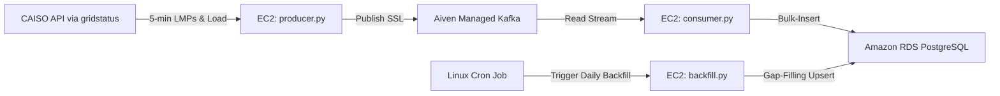

# CAISO Real-Time Grid Data & Pricing Platform

An enterprise-grade, lightweight, and cost-efficient ($0/month) real-time data engineering platform designed to ingest, stream, and store 5-minute interval electrical grid data from the **California ISO (CAISO)**. The platform captures wholesale electricity prices (**Locational Marginal Pricing - LMPs**) and **System Load** (grid demand vs forecast) and loads them into a time-series optimized **AWS RDS PostgreSQL** database.

---

## 🏗️ Architecture & Data Flow



1. **Ingestion Layer (`producer.py`)**: Runs 24/7 on an EC2 instance. It polls CAISO every 15 seconds. When a new 5-minute pricing or demand interval completes, it multiplexes the records into a single Kafka stream.
2. **Event Streaming Layer (Aiven Kafka)**: A managed serverless Kafka broker that buffers grid events and prevents database write-locking.
3. **Consumer Layer (`consumer.py`)**: A lightweight daemon consuming grid events and executing bulk database inserts.
4. **Self-Healing & Reconciliation (`backfill.py`)**: A daily cron job that queries today's historical grid records and performs a database `UPSERT` to automatically heal any data gaps from temporary network drops.

---

## 🗄️ Database Design & Optimization
The database runs on **Amazon RDS PostgreSQL** (`db.t4g.micro` - Free Tier) and tracks three key grid transmission hubs:
* **`TH_NP15`** (Northern California Transmission Hub)
* **`TH_SP15`** (Southern California Transmission Hub)
* **`TH_ZP26`** (Central California Transmission Hub)

### Schema & Indexing
To optimize range queries for downstream analytics and backtesting, the database structures:
* **`fact_caiso_lmp`**: Stores LMPs (Total wholesale price, congestion, and loss components).
* **`fact_caiso_load`**: Stores actual demand vs forecasted demand in Megawatts (MW).
* **B-Tree Indexing**: A composite index is created on `(node, event_timestamp DESC)` to allow sub-millisecond query search times.

---

## ⚙️ Repository Structure

```text
├── db_setup.py          # Database schema initialization script
├── ca.pem               # SSL Certificate (Git-ignored)
├── .env                 # Environment variables (Git-ignored)
├── .gitignore           # Safety rules (hides keys and certs)
├── requirements.txt     # Python package dependencies
└── kafka/
    ├── caiso_bootstrap.py # 7-day historical pagination loader
    ├── producer.py        # Real-time CAISO-to-Aiven Kafka publisher
    ├── consumer.py        # Real-time Aiven Kafka-to-PostgreSQL loader
    └── backfill.py        # Daily gap-filling & reconciliation script
```

---

## 🚀 Setup & Execution (On EC2)

### 1. Database Setup
Ensure your `.env` contains your AWS RDS credentials, and run the schema setup:
```bash
python db_setup.py
```

### 2. Historical Bootstrapping
Load the last 7 days of 5-minute historical pricing and load data:
```bash
python kafka/caiso_bootstrap.py
```

### 3. Run Ingestion 24/7 (Systemd)
Configure the producer and consumer as background services (`/etc/systemd/system/`):
```bash
# Start the live producer
sudo systemctl start caiso-producer
sudo systemctl enable caiso-producer

# Start the live consumer
sudo systemctl start caiso-consumer
sudo systemctl enable caiso-consumer
```

### 4. Schedule Daily Gap-Filling (Cron)
Add the daily backfiller to your crontab running daily at 23:59 UTC:
```bash
59 23 * * * /home/ubuntu/CAISO-Energy-Grid-Platform/.venv/bin/python /home/ubuntu/CAISO-Energy-Grid-Platform/kafka/backfill.py >> /home/ubuntu/backfill.log 2>&1
```
