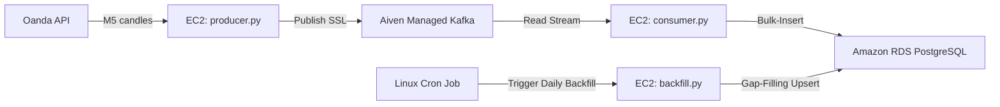

# Real-Time Forex & Commodity Time-Series Data Pipeline (AWS Free Tier)

An enterprise-grade, lightweight, and cost-efficient ($0/month) real-time data engineering pipeline designed to ingest, stream, and store 5-minute interval financial candles for Forex pairs (`USD_JPY`) and Commodities (`XAU_USD`, `XAG_USD`) from the **Oanda API** into a time-series optimized **AWS RDS PostgreSQL** database.

---

## 🏗️ Architecture & Data Flow



1. **Ingestion Layer (`producer.py`)**: Runs 24/7 on an EC2 instance. It polls Oanda’s REST API every 10 seconds. When a new 5-minute candle completes, it publishes the OHLC (Open, High, Low, Close) values and volume to Kafka.
2. **Event Streaming Layer (Aiven Kafka)**: A fully managed, serverless Kafka cluster on the cloud. Decouples ingestion from ingestion, protecting against message loss.
3. **Processing & Storage (`consumer.py`)**: A lightweight Python script consuming messages from Kafka and writing them to **Amazon RDS PostgreSQL** in real-time.
4. **Self-Healing & Gap-Filling (`backfill.py`)**: A daily cron job that queries Oanda's history for the entire day's candles and performs a database `UPSERT`. If any candles were missed due to network drops, it automatically heals the database gaps.

---

## 🛠️ Technology Stack

* **Source API**: Oanda Developer API (5-minute `M5` granularity candles).
* **Message Broker**: Aiven for Apache Kafka (Managed, Serverless, SSL-encrypted).
* **Database**: AWS RDS PostgreSQL (`db.t4g.micro` - Free Tier) with B-Tree composite indexes optimized for time-series range scans.
* **Orchestration**: Systemd Services (for 24/7 streaming) and Linux Cron (for daily reconciliation).
* **Environment**: AWS EC2 (`t2.micro` - Free Tier Ubuntu 22.04 LTS).

---

## 📁 Repository Structure

```text
├── db_setup.py          # Database schema initialization script
├── ca.pem               # SSL Certificate (Git-ignored)
├── .env                 # Environment variables (Git-ignored)
├── .gitignore           # Safety rules (hides keys and certs)
├── requirements.txt     # Python package dependencies
└── kafka/
    ├── db_bootstrap.py  # 10-year historical pagination loader (2016-today)
    ├── producer.py      # Real-time Oanda-to-Aiven Kafka publisher
    ├── consumer.py      # Real-time Aiven Kafka-to-PostgreSQL loader
    └── backfill.py      # Daily gap-filling & reconciliation script
```

---

## ⚙️ Configuration & Deployment

### 1. Database Setup (AWS RDS PostgreSQL)
Create a PostgreSQL database on AWS RDS using the **Free Tier** template:
* Class: `db.t4g.micro` (or `db.t2.micro`)
* Storage: 20 GB gp2 SSD (Autoscaling disabled)
* Public Access: **Yes** (to query from Spyder/local IDEs)
* Port: `5432` (Security Group inbound rule open to public `0.0.0.0/0`)

### 2. Message Broker (Aiven Kafka)
Sign up on Aiven, create a free **Apache Kafka** cluster, and:
1. Create a topic named **`stock-prices`**.
2. Download the **CA Certificate** (`ca.pem`) and save it in the project root directory.
3. Copy the **Service URI** (Bootstrap Server).

### 3. Environment Variables (`.env`)
Create a `.env` file in the root folder:
```env
OANDA_API_KEY=your_oanda_api_key
OANDA_ENVIRONMENT=practice

AIVEN_KAFKA_BOOTSTRAP_SERVER=your_aiven_uri:port
AIVEN_KAFKA_CA_CERT_PATH=/home/ubuntu/Real-Time-Stock-Data-Engineering-Project/ca.pem

RDS_POSTGRES_HOST=your_rds_endpoint
RDS_POSTGRES_USER=postgres
RDS_POSTGRES_PASSWORD=your_db_password
```

### 4. Database Bootstrapping
Before starting the live streams, run the database setup and load 10 years of historical data:
```bash
# 1. Create tables and Dimension profiles
python db_setup.py

# 2. Bulk-load historical M5 candles (2016-Today) and build B-Tree indexes
python kafka/db_bootstrap.py
```

### 5. Running 24/7 on EC2
Deploy the scripts as Systemd background daemons on your Ubuntu instance:
```bash
sudo nano /etc/systemd/system/forex-consumer.service
```
Paste the following config:
```ini
[Unit]
Description=Oanda Forex PostgreSQL Consumer
After=network.target

[Service]
User=ubuntu
WorkingDirectory=/home/ubuntu/Real-Time-Stock-Data-Engineering-Project
ExecStart=/home/ubuntu/Real-Time-Stock-Data-Engineering-Project/.venv/bin/python /home/ubuntu/Real-Time-Stock-Data-Engineering-Project/kafka/consumer.py
Restart=always

[Install]
WantedBy=multi-user.target
```
Enable and start the service:
```bash
sudo systemctl daemon-reload
sudo systemctl enable forex-consumer
sudo systemctl start forex-consumer
```
*(Repeat the same configuration for the producer script `producer.py` to keep it running 24/7).*

---

## 📈 Time-Series Query Optimization
To optimize read operations for strategy backtesting (e.g., in Spyder or Jupyter Notebooks), the database builds a composite B-Tree index on `(ticker, event_timestamp DESC)`. This reduces query search complexity from $O(N)$ full table scans to $O(\log N)$ index scans, returning years of data in milliseconds.
